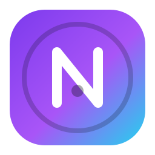

# NovaShell

An original, controller-first, console-style desktop shell for **Ubuntu**. NovaShell turns a stock Ubuntu/GNOME session into a game-console experience — a fast launcher for your Steam and Heroic libraries, native apps, and a polished home shell — while fronting the real desktop underneath.

- **Original design.** No console-brand assets or trademarks; the UI, icons, sounds and layout are all NovaShell's own. Visual language: dark, glassy panels, an accent glow you can re-color, rem-based scaling for 1080p → 4K.
- **Controller-first.** Navigate everything with a gamepad (d-pad + stick, `A` confirm, `B` back, `L1/R1` tabs, `L2/R2` quick menu, `Share` screenshot). Keyboard and mouse work too.
- **One window, one process.** GTK4 + WebKitGTK6 window with a single self-contained HTML/CSS/JS UI (offline, no CDNs), driven by a Rust core.
- **Non-destructive by default.** NovaShell never touches GRUB, kernel parameters or GNOME's configuration. GNOME stays installed as the fallback desktop, and *Return to desktop* simply exits NovaShell back to your session. Running the app from the desktop installs nothing; the optional `scripts/install.sh` and `scripts/install-service.sh` do install a systemd unit and/or an autostart entry, and `scripts/uninstall.sh` removes them again.
- **Extensible.** Launchers are providers (Steam, Heroic, desktop entries). Add your own by implementing one trait.



## Quick start (Ubuntu 24.04+)

```bash
# 1. Install build deps
sudo apt update
sudo apt install curl build-essential pkg-config \
                 libgtk-4-dev libwebkitgtk-6.0-dev libjavascriptcoregtk-6.0-dev \
                 libudev-dev

# 2. Install Rust (stable >= 1.85)
curl --proto '=https' --tlsv1.2 -sSf https://sh.rustup.rs | sh

# 3. Build & try (windowed dev mode)
./scripts/build.sh
./scripts/run-dev.sh

# 4. Install (system-wide, or add --user)
sudo ./scripts/install.sh
```

Full instructions live in [`docs/`](docs/):
[Architecture](docs/ARCHITECTURE.md) · [Building](docs/BUILDING.md) · [Installing](docs/INSTALL.md) · [Uninstalling](docs/UNINSTALL.md) · [Controllers](docs/CONTROLLERS.md) · [Steam](docs/STEAM.md) · [Heroic](docs/HEROIC.md) · [Troubleshooting](docs/TROUBLESHOOTING.md) · [Recovery](docs/RECOVERY.md) · [Dependencies](docs/DEPENDENCIES.md) · [Limitations](docs/LIMITATIONS.md)

## Where things live at runtime

| Thing | Path |
| --- | --- |
| Config | `~/.config/novashell/config.json` |
| Game library (favorites, playtime) | `~/.local/share/novashell/library.json` |
| Logs | `~/.local/share/novashell/logs/nova-YYYYMMDD.log` |
| Screenshots | `~/.local/share/novashell/screenshots/` |
| Optional custom UI | `NOVASHELL_UI=/path/to/index.html` |

## Project layout

```
src/
  shell/        GTK window, WebKit bridge, message router, watchdog
  ui/           WebKit <-> JS bridge helpers
  system/       hardware/OS introspection + power/screenshots (Linux)
  controllers/  gilrs gamepad input -> abstract actions (Linux)
  games/        library model, favorites, playtime, persistence
  integrations/ steam, heroic, desktop-entry providers
  plugins/      provider registry
  launcher/     process launching, .desktop Exec parsing
  settings/     config model
  util/         paths, env overrides (used by tests for isolation)
ui/index.html   the entire UI (single self-contained file)
scripts/        build / install / uninstall / dev / test helpers
data/           desktop entries, systemd unit, autostart
docs/           this documentation
assets/         original SVG icon
```

## Controls summary

| Controller | Action |
| --- | --- |
| D-pad / left stick | Move focus |
| South (A) | Confirm / launch |
| East (B) | Back / close overlay |
| North (Y) | Favorite current game |
| LB / RB | Switch tabs (Home / Library / Settings) |
| LT / RT | Open / close Quick Menu |
| Menu / View | Open search |
| Guide / Share | Screenshot |

Keyboard: `arrows` move, `Enter` confirm, `Esc` back, `Q` quick menu, `/` search, `F2` screenshot, `1/2/3` tabs.

```text
NovaShell — made with care. See docs/ for details.
```